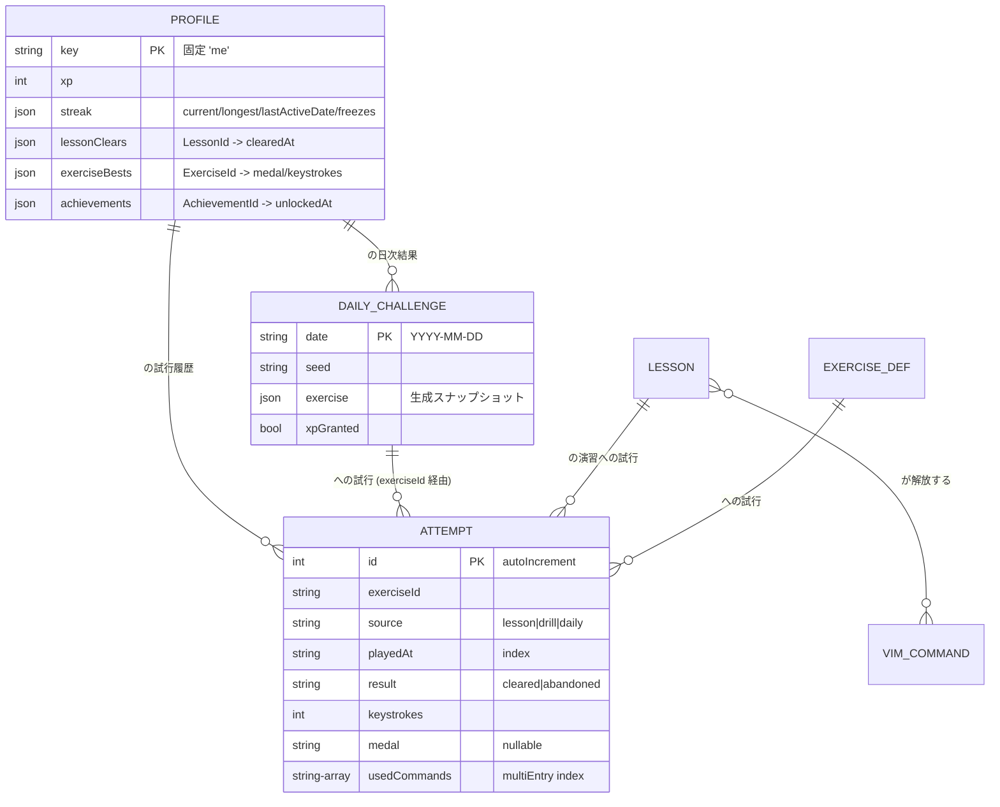

# DB設計 — vim-dojo

最終更新: 2026-07-11

このプロジェクトの永続化層は **IndexedDB**(ブラウザ内、ADR-0001)である。RDB は存在しないため、本ドキュメントは IndexedDB のオブジェクトストア設計・不変条件の守り方・スキーマ移行方針を「DB設計」として定義する。アクセスは `idb` ラッパー(ADR-0007)を用い、`src/storage/` が core の `ProgressStore` ポートを実装する。

## 設計原則

1. **真実の所在を一つにする**: 導出できるものは保存しない(例: 解放済みコマンドはレッスンクリア記録から導出。レベルは累積 XP から導出)。二重管理は食い違いの温床。
2. **境界でパースする**: IndexedDB から読んだデータは信用しない(旧バージョン・手動編集・破損がありうる)。読み込み時に zod スキーマで一度だけパースし、core には型付きの値だけを渡す(型安全原則)。
3. **追記優先**: 試行履歴(attempts)は append-only。上書き・削除しない(成長グラフ・弱点分析の原資であり、これ自体が監査ログを兼ねる)。

## エンティティ一覧(オブジェクトストア)

DB 名: `vim-dojo`。ストアは3つ。

| ストア            | keyPath                       | 役割                                                                                 | 対応するドメイン用語                                                |
| ----------------- | ----------------------------- | ------------------------------------------------------------------------------------ | ------------------------------------------------------------------- |
| `profile`         | 固定キー `"me"`(シングルトン) | プレイヤーの現在状態: XP・実績・ストリーク・フリーズ・レッスンクリア記録・お題ベスト | Progress, Streak, StreakFreeze, xp, Achievement, Lesson(クリア状況) |
| `attempts`        | 自動採番 `id`                 | お題への試行の追記ログ。1試行=1レコード                                              | Attempt, keystroke, Medal                                           |
| `dailyChallenges` | `date`(`"YYYY-MM-DD"`)        | 日ごとのデイリーチャレンジ: シード・お題スナップショット・結果                       | DailyChallenge, seed                                                |

**保存しないもの(導出・コード管理)**:

- カリキュラム・レッスン定義・パー: アプリのコード(TS の静的データ)として Git 管理。DB には入れない(seed 参照)。
- 解放済みコマンド: `profile.lessonClears` から導出(R5)。
- レベル: `profile.xp` から導出(R17)。
- 弱点コマンド: `attempts` から都度計算(P5)。キャッシュが必要になったら見直し。

## スキーマ(zod が正、型は z.infer で生成)

```ts
// storage/schema.ts — 保存形の唯一の定義。手書きの型二重管理をしない
const ProfileSchema = z.object({
  key: z.literal("me"),
  xp: z.number().int().nonnegative(),
  streak: z.object({
    current: z.number().int().nonnegative(),
    longest: z.number().int().nonnegative(),
    lastActiveDate: LocalDate.nullable(), // "YYYY-MM-DD" branded
    freezes: z.number().int().min(0).max(2), // R11
  }),
  lessonClears: z.record(LessonId, z.object({ clearedAt: IsoDateTime })),
  exerciseBests: z.record(
    ExerciseId,
    z.object({
      medal: z.enum(["gold", "silver", "bronze"]),
      keystrokes: z.number().int().positive(),
    }),
  ),
  achievements: z.record(AchievementId, z.object({ unlockedAt: IsoDateTime })),
  lastExportAt: IsoDateTime.nullable(), // エクスポート促し(UC6)用
});

const AttemptSchema = z.object({
  id: z.number().int().optional(), // autoIncrement
  exerciseId: ExerciseId,
  source: z.enum(["lesson", "drill", "daily"]),
  playedAt: IsoDateTime, // 完了時刻。日付判定は R12 に従う
  result: z.enum(["cleared", "abandoned"]),
  keystrokes: z.number().int().nonnegative(),
  medal: z.enum(["gold", "silver", "bronze"]).nullable(),
  usedCommands: z.array(CommandId), // 弱点分析(R19)用。multiEntry index
  durationMs: z.number().int().nonnegative(),
});

const DailyChallengeSchema = z.object({
  date: LocalDate, // keyPath。1日1問(R13)
  seed: z.string(),
  exercise: ExerciseSnapshotSchema, // 生成結果の凍結(再現性のため)
  xpGranted: z.boolean(), // R15: XP は初回クリアのみ
});
```

ID(`LessonId`, `ExerciseId`, `CommandId`)は zod の `.brand()` による branded type とし、取り違えをコンパイルエラーにする。

## リレーション(ER 図)

IndexedDB に FK は無いが、論理的な参照関係を示す。`LESSON` / `EXERCISE_DEF` はコード管理の静的データ(点線側)。



## 制約(ドメイン不変条件をどこで守るか)

IndexedDB には NOT NULL / CHECK / FK が無い。不変条件は「keyPath の一意性」「zod パース」「core のロジック」の3段で守る。

| 不変条件                           | 業務的根拠       | 守る場所                                                     |
| ---------------------------------- | ---------------- | ------------------------------------------------------------ |
| profile は1件のみ                  | 利用者1名        | keyPath 固定値 `"me"`(構造的に重複不可)                      |
| デイリーチャレンジは1日1問         | R13              | `dailyChallenges` の keyPath = `date`(同日 put は上書きのみ) |
| フリーズは 0〜2 個                 | R11              | zod `min(0).max(2)` + core の増減ロジック                    |
| XP・キーストロークは非負整数       | R16, R2          | zod `int().nonnegative()`                                    |
| メダルは3値、結果は2値             | R3               | zod enum(判別可能ユニオンとして core に渡る)                 |
| 未解放コマンド必須のお題を出さない | R6               | core/generation のロジック(保存時ではなく生成時に保証)       |
| attempts は不変(追記のみ)          | 分析の原資・監査 | storage 層に update/delete API を作らない                    |

## インデックス

| ストア            | インデックス               | 対応する主要クエリ                                             |
| ----------------- | -------------------------- | -------------------------------------------------------------- |
| `attempts`        | `playedAt`                 | 成長グラフ(期間指定の履歴取得)、「今日の学習活動があるか」(R8) |
| `attempts`        | `usedCommands`(multiEntry) | 弱点分析: コマンドごとの直近5試行(P5)                          |
| `attempts`        | `exerciseId`               | 同一お題のベスト更新判定(R4)・改善推移                         |
| `dailyChallenges` | (keyPath=date のみ)        | 当日分の取得・ストリーク表示                                   |

パフォーマンス方針: 起動時に読むのは `profile` 1件 + 当日の `dailyChallenges` 1件のみ(起動サクサク要件)。`attempts` の全件走査は分析画面を開いたときだけ遅延実行する。

## migration ルール

- スキーマ変更は IndexedDB の version(整数)を上げ、`onupgradeneeded` 内の移行関数として書く。ストアやデータを直接いじる場当たり対応をしない。
- 移行関数は `storage/migrations.ts` に「v1→v2, v2→v3…」と純粋な変換として並べ、どの旧バージョンからでも順次適用で最新に到達できるようにする。
- **後方互換の守り方**: フィールド追加はデフォルト値付きで(zod `.default()`)。改名・削除・型変更(破壊的変更)は「新フィールド追加 → 移行で値をコピー → 次のバージョンで旧フィールド削除」の2段階で行う。
- **ロールバック**: IndexedDB はバージョンダウングレード不可。破壊的移行の直前に自動でエクスポート JSON(下記)をダウンロード保存させ、これをロールバック手段とする。手順を移行関数のコメントに書く。
- スキーマを変更したら、同じ変更内で本ドキュメントの zod スキーマ・ER 図・バージョン履歴表を更新する。

### バージョン履歴

| version | 日付         | 変更                                            |
| ------- | ------------ | ----------------------------------------------- |
| 1       | (初回実装時) | `profile` / `attempts` / `dailyChallenges` 作成 |

## エクスポート / インポート形式(UC6)

```json
{ "app": "vim-dojo", "schemaVersion": 1, "exportedAt": "...", "profile": {...}, "attempts": [...], "dailyChallenges": [...] }
```

- インポートは zod でパースし、`schemaVersion` が古ければ migration と同じ変換関数を通す(移行ロジックの二重実装をしない)。
- インポートは全置換(マージしない)。実行前に現行データの自動エクスポートを促す。

## seed データ

- カリキュラム(ステージ・レッスン・お題定義・パー)はコード管理の静的 TS データ(`src/core/curriculum/` 配下)。DB への投入は無い。
- 開発用のダミー進捗は `fixtures/` にエクスポート形式の JSON として置き、インポート機能で投入する(専用の seed 機構を作らない)。

## 削除方針

| ストア            | 方針                             | 理由                                                              |
| ----------------- | -------------------------------- | ----------------------------------------------------------------- |
| `attempts`        | 削除しない(append-only)          | 分析の原資。1試行=数百バイトで数年分でも問題にならない            |
| `dailyChallenges` | 削除しない                       | 1日1件しか増えない                                                |
| `profile`         | 全リセット機能のみ(個別削除なし) | リセットは確認ダイアログ+事前エクスポート必須(domain.md 禁止事項) |

論理削除は導入しない(単一ユーザーで「削除の取り消し」要求が無い。エクスポートが実質のごみ箱)。

## 監査ログ方針

単一ユーザー・ローカル完結のため専用の監査テーブルは作らない。`attempts` の append-only ログと `profile` 内の各種タイムスタンプ(`clearedAt`, `unlockedAt`)が「いつ何が起きたか」の記録を兼ねる。

## ドメインモデルとの食い違い

既存スキーマは無いため食い違いはゼロ。設計上の意図的な差異のみ記す:

| 項目             | domain.md           | 本設計                         | 理由                                                    |
| ---------------- | ------------------- | ------------------------------ | ------------------------------------------------------- |
| 解放済みコマンド | Progress に含まれる | 保存せず lessonClears から導出 | 真実の所在を一つに(R5 と二重管理になる)                 |
| レベル           | Progress に含まれる | 保存せず xp から導出           | R17(累積 XP のみから計算)そのまま                       |
| 弱点コマンド     | Progress の分析対象 | 保存せず attempts から都度計算 | P5 の閾値が暫定のため、保存すると調整のたびに移行が要る |
