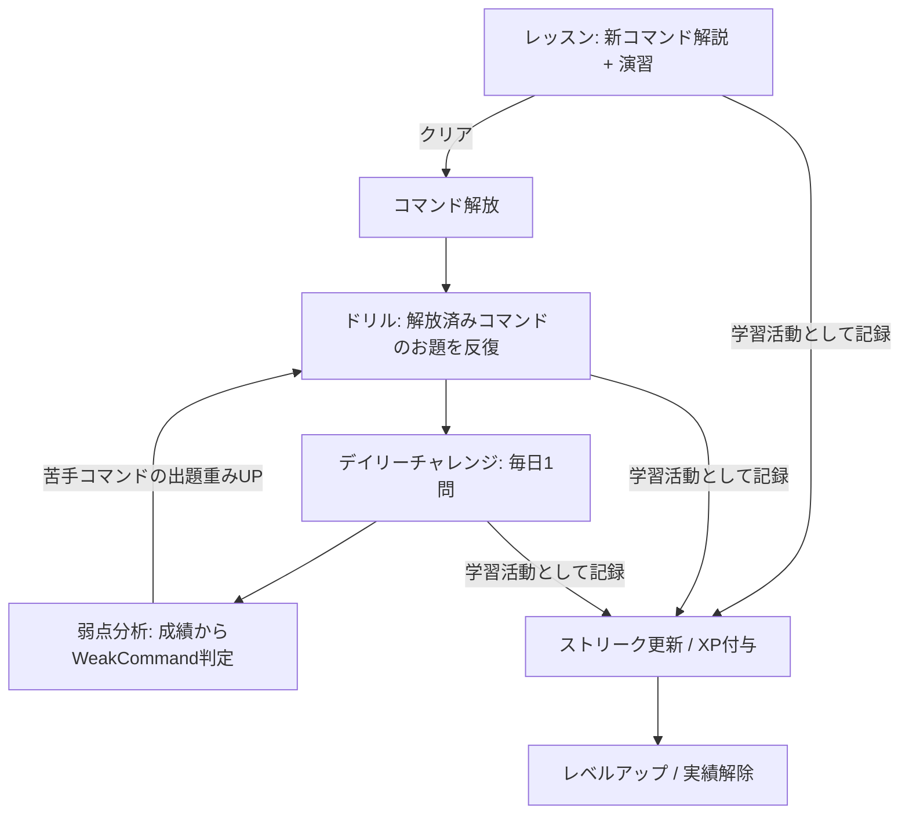

# ドメイン理解 — vim-dojo

最終更新: 2026-07-11(プロダクトオーナーへのヒアリングに基づく)

このドキュメントは vim-dojo のユビキタス言語と業務ルールを定義する。**コード・テスト・ドキュメント・UI 文言は、ここで定義した用語(と対応するコード名)を一貫して使うこと。** 前提となる要件は `docs/project-overview.md` を参照。

> この用語集がコード上の命名の正典(カノン)。コード名列は実装と同期している(例: `Exercise` = `src/core/practice/exercise.ts`)。

## 用語集

| 用語                        | コード名                               | 定義                                                                                                                                                                                                                                                                                                                                                                                                                                                                                                      |
| --------------------------- | -------------------------------------- | --------------------------------------------------------------------------------------------------------------------------------------------------------------------------------------------------------------------------------------------------------------------------------------------------------------------------------------------------------------------------------------------------------------------------------------------------------------------------------------------------------- |
| プレイヤー                  | `Player`                               | 学習者。初期スコープではオーナー1名。                                                                                                                                                                                                                                                                                                                                                                                                                                                                     |
| カリキュラム                | `Curriculum`                           | 学習内容の全体構成。4つのステージからなる。                                                                                                                                                                                                                                                                                                                                                                                                                                                               |
| ステージ                    | `Stage`                                | カリキュラムの大区分。全8ステージ(ゴール=実務の vim が一通り操作できる)。①基本移動・モード操作 ②編集の型(d/c/y×テキストオブジェクト・.) ③検索と置換(:s/:%s/:g) ④レジスタの奥義 ⑤効率化の型(A/I/o/O・r/R・J・ct)/dt,・~) ⑥検索の達人(/? n/N ・* # ・; ,) ⑦ビジュアルの型(v/V/Ctrl-v・gU/gu 等) ⑧実戦 皆伝(全技を使う実務シナリオ総まとめ)。当初4→8に拡張(2026-07-12)。マクロは対象外(オーナー決定)。複数ファイルはエンジン単一バッファ前提(ADR-0006)のためレッスンでは解説・豆知識に留め、ドリル化しない。 |
| レッスン                    | `Lesson`                               | ステージ内の学習単位。新コマンドの解説と演習お題のセット。クリアでコマンドが解放される。                                                                                                                                                                                                                                                                                                                                                                                                                  |
| コマンド                    | `VimCommand`                           | 学習対象の vim 操作(例: `w`, `diw`, `:s`)。レッスンにより「解放」される。                                                                                                                                                                                                                                                                                                                                                                                                                                 |
| 解放                        | `unlock` / `UnlockedCommand`           | レッスンクリアによりコマンドがドリル・デイリーチャレンジの出題対象になること。                                                                                                                                                                                                                                                                                                                                                                                                                            |
| お題                        | `Exercise`                             | 演習課題の最小単位。開始バッファ・目標バッファ・パーで構成される。                                                                                                                                                                                                                                                                                                                                                                                                                                        |
| 開始バッファ / 目標バッファ | `initialBuffer` / `targetBuffer`       | お題の初期テキストと、一致すればクリアとなる目標テキスト。                                                                                                                                                                                                                                                                                                                                                                                                                                                |
| パー                        | `par`                                  | お題ごとの基準キーストローク数。メダル判定の基準。ゴルフ用語に由来。                                                                                                                                                                                                                                                                                                                                                                                                                                      |
| キーストローク              | `keystroke`                            | プレイヤーが押した1キー入力。スコアの計測単位。                                                                                                                                                                                                                                                                                                                                                                                                                                                           |
| 試行                        | `Attempt`                              | お題への1回の挑戦。キーストローク列・所要時間・結果(クリア/放棄)を記録する。                                                                                                                                                                                                                                                                                                                                                                                                                              |
| メダル                      | `Medal` (`gold` / `silver` / `bronze`) | クリア時の評価。パー以内=金、パー×1.5以内=銀、クリア=銅。                                                                                                                                                                                                                                                                                                                                                                                                                                                 |
| ドリル                      | `Drill`                                | 解放済みコマンドを使うお題を連続で解く反復セッション。                                                                                                                                                                                                                                                                                                                                                                                                                                                    |
| デイリーチャレンジ          | `DailyChallenge`                       | 1日1問の日替わりお題。シードから自動生成される。                                                                                                                                                                                                                                                                                                                                                                                                                                                          |
| シード                      | `seed`                                 | お題自動生成の乱数種。デイリーチャレンジでは日付から決定的に導出する。                                                                                                                                                                                                                                                                                                                                                                                                                                    |
| 学習活動                    | `LearningActivity`                     | ストリーク継続の条件となる活動。レッスンクリア・ドリルセッション完了・デイリーチャレンジクリア・**コマンドクイズ完了(スマホ向け)**のいずれか。クイズはタップ式の認識ドリルで、ストリークは維持するが XP・メダルは付かない。                                                                                                                                                                                                                                                                               |
| ストリーク                  | `Streak`                               | 学習活動を行った連続日数。                                                                                                                                                                                                                                                                                                                                                                                                                                                                                |
| フリーズ                    | `StreakFreeze`                         | サボった日に自動消費されてストリークを守るアイテム。最大2個ストック。                                                                                                                                                                                                                                                                                                                                                                                                                                     |
| XP                          | `xp`                                   | 学習活動で得る経験値。レベルの源泉。                                                                                                                                                                                                                                                                                                                                                                                                                                                                      |
| レベル                      | `Level`                                | 累積 XP による段位。                                                                                                                                                                                                                                                                                                                                                                                                                                                                                      |
| 実績                        | `Achievement`                          | 条件達成で解除されるバッジ(例: 初の金メダル、ストリーク30日)。                                                                                                                                                                                                                                                                                                                                                                                                                                            |
| 弱点コマンド                | `WeakCommand`                          | 成績データから「苦手」と判定されたコマンド。ドリルで再出題の重みが上がる。                                                                                                                                                                                                                                                                                                                                                                                                                                |
| 進捗                        | `Progress`                             | プレイヤーの永続データ全体。含むもの: レッスンクリア状況、解放済みコマンド、お題ごとのベストメダル・ベストキーストローク、試行履歴(習熟度・弱点分析の元データ)、XP・レベル・実績、ストリーク・フリーズ在庫。すべてブラウザローカルに自動保存され、明示的な「セーブ操作」は不要。                                                                                                                                                                                                                          |

## 登場人物

| アクター                        | 役割                                                                                                             |
| ------------------------------- | ---------------------------------------------------------------------------------------------------------------- |
| プレイヤー(オーナー)            | 唯一の人間アクター。学習し、進捗データを所有する。                                                               |
| お題生成器(`ExerciseGenerator`) | シードと解放済みコマンド集合からお題を決定的に生成する内部システム。                                             |
| 通知サービス(ntfy.sh 等)        | 外部システム。デイリーチャレンジのリマインドをスマホに届ける。アプリ本体とはデータを共有しない(進捗を送らない)。 |

## 業務フロー

## ユースケース一覧

| #   | アクター     | やりたいこと                                                        |
| --- | ------------ | ------------------------------------------------------------------- |
| UC1 | プレイヤー   | レッスンで新しいコマンドを学び、演習でクリアして解放する            |
| UC2 | プレイヤー   | ドリルで解放済みコマンドを反復し、メダルを狙う                      |
| UC3 | プレイヤー   | デイリーチャレンジを解いてストリークを伸ばす                        |
| UC4 | プレイヤー   | 自分の成長(キーストローク効率の推移)と弱点を確認する                |
| UC5 | プレイヤー   | XP・レベル・実績を確認する                                          |
| UC6 | プレイヤー   | 進捗データをエクスポート/インポートする(ブラウザデータ消去への備え) |
| UC7 | 通知サービス | 毎日決まった時刻にリマインド通知をスマホへ送る                      |

## 業務ルール(検証可能な条件として)

### クリア判定・スコア

- R1: お題は「エディタのバッファ内容が `targetBuffer` と完全一致した瞬間」に自動でクリアとなる。カーソル位置は問わない。
- R2: 試行のキーストローク数は、最初のキー入力からクリアまでに押された全キーを数える(Esc・モード切替・取り消し `u` も含む)。
- R3: メダル判定: `keystrokes <= par` なら金、`keystrokes <= ceil(par * 1.5)` なら銀、クリアすれば銅。
- R4: 同一お題を再挑戦した場合、メダルはベスト記録で上書きされる(下がらない)。

### 解放・カリキュラム

- R5: コマンドはレッスンクリアによってのみ解放される。
- R6: ドリルとデイリーチャレンジのお題は、生成時点の解放済みコマンドだけで最適解が構成できるものに限る(未習コマンドが必須となるお題を出してはならない)。
- R7: ステージ内のレッスンは順序付きで、前のレッスンをクリアすると次が挑戦可能になる。

### ストリーク・フリーズ

- R8: 1日(ローカルタイムゾーンの 0:00 区切り)に1つ以上の学習活動を完了すれば、その日は「アクティブ日」となる。
- R9: ストリークは連続したアクティブ日の数。アクティブでない日が発生した時、フリーズの在庫があれば自動で1個消費され、ストリークは維持される(その日はアクティブ日にはならない)。
- R10: フリーズの在庫が0の状態でアクティブでない日が発生したら、ストリークは0にリセットされる。
- R11: フリーズの最大ストックは2個。
- R12: 学習活動の完了日時は活動が「完了した瞬間」のローカル日付で記録する(23:59 に開始して 0:01 にクリアした場合は翌日の活動)。

### デイリーチャレンジ

- R13: デイリーチャレンジは1日1問。シードは日付から決定的に導出し、同じ日に再生成しても同じお題になる。
- R14: お題はその日最初にデイリーチャレンジ画面を開いた時点の解放済みコマンド範囲から生成する。
- R15: 同じ日のデイリーチャレンジは何度でも再挑戦できるが、XP が付与されるのは初回クリアのみ(メダルのベスト更新は可)。

### XP・レベル・実績

- R16: XP は学習活動の完了時に付与される。同一レッスンの再クリア・同一お題の再クリアでは重複付与しない(デイリーチャレンジは R15 に従う)。
- R17: レベルは累積 XP のみから計算される(減らない)。
- R18: 実績は条件を満たした瞬間に解除され、解除済み実績は取り消されない。

### 弱点分析

- R19: 弱点判定は試行履歴(お題に使われたコマンドとメダル結果)から計算する。弱点コマンドはドリル生成時の出題重みが上がる。

## 例外ケース

| ケース                            | 業務的な扱い                                                                                                |
| --------------------------------- | ----------------------------------------------------------------------------------------------------------- |
| お題を途中で放棄(リタイア)        | 試行は「放棄」として記録。メダル・XP なし。弱点分析の入力にはなる。                                         |
| 生成されたお題が自明すぎる/解なし | 生成器はパーの下限(例: 3キー以上)を保証し、`initialBuffer == targetBuffer` となるお題を生成してはならない。 |
| ブラウザのデータ消去で進捗喪失    | エクスポート/インポート(UC6)で緩和。アプリは定期的にエクスポートを促してよい。                              |
| タイムゾーンをまたぐ移動          | デバイスのローカルタイムゾーンを常に正とする。日付の重複・欠落が起きても遡って補正しない。                  |
| ストリークが0にリセットされた     | ペナルティはリセットのみ。復帰初日は通常どおり1日目として数える。                                           |
| 通知サービスが停止/未達           | 通知はベストエフォート。アプリ本体の動作・ストリーク判定には影響しない。                                    |

## 禁止事項

- 未解放コマンドが最適解に必須となるお題を出題しない(R6)。
- 進捗データを警告なしに破壊しない(リセット機能には確認とエクスポート導線を付ける)。
- ストリーク・実績・メダルを遡って不利に改変しない(データ修復を除く)。
- 進捗・成績データを外部(通知サービス含む)へ送信しない。通知はリマインド文言のみ。

## 判断に迷うケース(暫定判断)

確定ではない。実装前に見直し、確定したら本文のルールへ昇格させる。

| #   | 論点                      | 暫定判断                                                                                                                                                                                                                                                                                    | 根拠                                                                                                                                              |
| --- | ------------------------- | ------------------------------------------------------------------------------------------------------------------------------------------------------------------------------------------------------------------------------------------------------------------------------------------- | ------------------------------------------------------------------------------------------------------------------------------------------------- |
| P1  | XP の具体量               | レッスンクリア 20 / お題クリア(レッスン内・ドリル共通)金10・銀7・銅5 / デイリーチャレンジ初回クリア 15(金メダル時はボーナス+5)。※レッスン1周 = お題XP+20(オーナー確認済み 2026-07-11)。実装: `core/progression/xp.ts`                                                                       | Duolingo 等の相場感。バランスは実装後に調整                                                                                                       |
| P2  | レベル曲線                | レベル N に必要な累積 XP = 100 × N × (N+1) / 2(徐々に重くなる)                                                                                                                                                                                                                              | 序盤のテンポと長期の持続性の両立                                                                                                                  |
| P3  | フリーズの補充条件        | 7日連続アクティブごとに1個補充(最大2個)                                                                                                                                                                                                                                                     | 「続けた人ほど守られる」の整合。XP 購入制は通貨概念が増えるため見送り                                                                             |
| P4  | パーの決め方              | 生成器が知る最適解のキーストローク数をパーとする。手作りお題は作者が最適解を実演して設定                                                                                                                                                                                                    | パーが理論最適である保証は不要(ゴルフも同様)。銀・銅で救済される                                                                                  |
| P5  | 弱点判定の閾値            | 直近5試行のうち銀以上が2回以下のコマンドを弱点とする(試行3回未満のコマンドは判定対象外 — 情報不足での誤判定を防ぐ)。実装: `core/analytics/weakness.ts`                                                                                                                                      | 少ない試行数で判定できる単純なルールから始める                                                                                                    |
| P6  | ドリルの1セッションの長さ | 5問で1セッション                                                                                                                                                                                                                                                                            | 「毎日サクッと」の体感を優先。要調整                                                                                                              |
| P7  | 通知の時刻・文言          | 毎日20:00、固定文言(進捗データを含めない)                                                                                                                                                                                                                                                   | 禁止事項(データ外部送信しない)との整合                                                                                                            |
| P8  | UI 言語                   | 日本語のみ。i18n の抽象化は入れない                                                                                                                                                                                                                                                         | 個人用途。公開時に必要になってから対応(YAGNI)                                                                                                     |
| P9  | vim 挙動の基準            | 素の vim の文法をメインとし、挙動は Neovim のモダンな標準を正とする(例: `Y` = `y$`)。エミュレータ(ADR-0006)がデフォルトで再現しない箇所は `src/vim/` のラッパーで設定・上書きする。レッスンにはモダン環境差異の豆知識注記(任意フィールド)を持たせられる(例: LazyVim では `s` は flash.nvim) | 普遍的な文法を鍛えれば環境を問わず通用する。オーナーは LazyVim に興味があるため、将来移行しても困らない豆知識を添える(プラグイン再現はスコープ外) |
| P10 | フリーズの部分消費        | 欠損日数をフリーズ在庫で全部カバーできる場合のみ消費する。足りない場合は消費せずストリークをリセット(実装: `core/progression/streak.ts`)                                                                                                                                                    | 消費してもストリークが守れないなら、次のストリークのために取っておくほうがプレイヤーに優しい                                                      |
| P12 | 難易度設定                | 全体設定1つ(やさしい/ふつう/むずい)。メダル基準(金=パー×係数)と補助(ヒント・答え合わせ・入力キー表示)を調整するだけ。クリア可否は変えない=どの難易度でもストリークは安全。実装: `core/difficulty.ts`。設定は UI 設定(localStorage)で Profile には保存しない                                 | 両端(退屈な上級者/つまずく初心者)に効く。当初はステージ別解禁案もあったが全体設定1つから開始(オーナー選択)                                        |
| P11 | 過去日付の活動            | 記録済みの最終アクティブ日より前の日付の活動は無視する(時計の巻き戻り等)。ストリークを遡って改変しない(禁止事項と整合)                                                                                                                                                                      | まれなケースに複雑な補正を実装しない                                                                                                              |

## 境界づけられたコンテキスト候補(モジュール分割の議論材料)

アーキテクチャ設計フェーズへのインプット。

| コンテキスト                | 責務                                                     | 主な用語                              |
| --------------------------- | -------------------------------------------------------- | ------------------------------------- |
| 演習(Practice)              | vim 編集セッションの実行、キーストローク記録、クリア判定 | Exercise, Attempt, keystroke          |
| カリキュラム(Curriculum)    | ステージ・レッスンの構成、コマンド解放の管理             | Stage, Lesson, VimCommand, unlock     |
| 出題生成(Generation)        | シードからのお題生成、パー算出、出題範囲の制約充足       | ExerciseGenerator, seed, par          |
| 進捗・動機づけ(Progression) | ストリーク、フリーズ、XP、レベル、実績                   | Streak, StreakFreeze, xp, Achievement |
| 分析(Analytics)             | 成長の可視化、弱点判定                                   | WeakCommand, Attempt履歴              |

vim エミュレーション自体(モード・コマンドの実装)はドメインではなく技術基盤であり、演習コンテキストの下のインフラ層に置く想定。→ アーキテクチャ設計・技術選定フェーズで決定。
